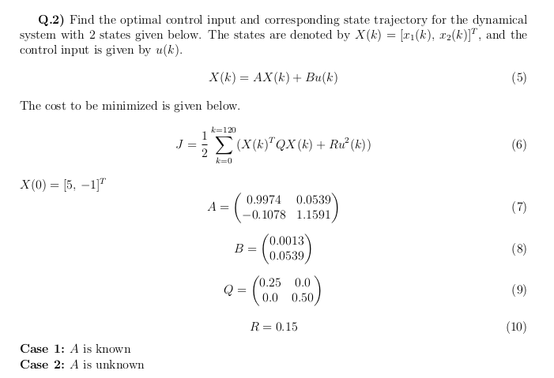
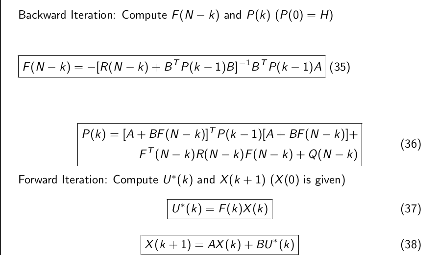
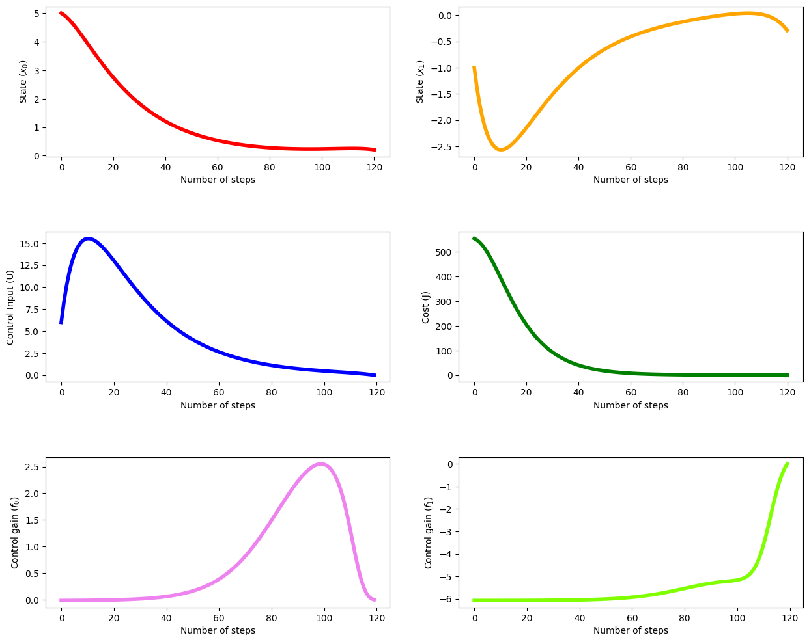
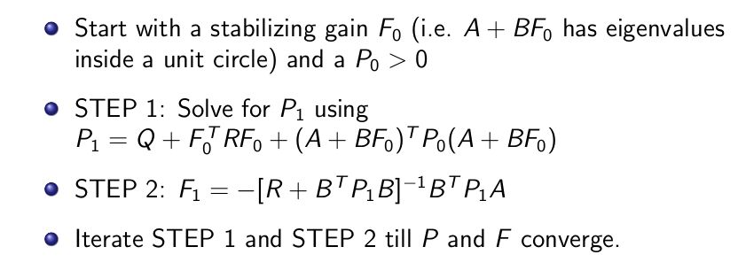
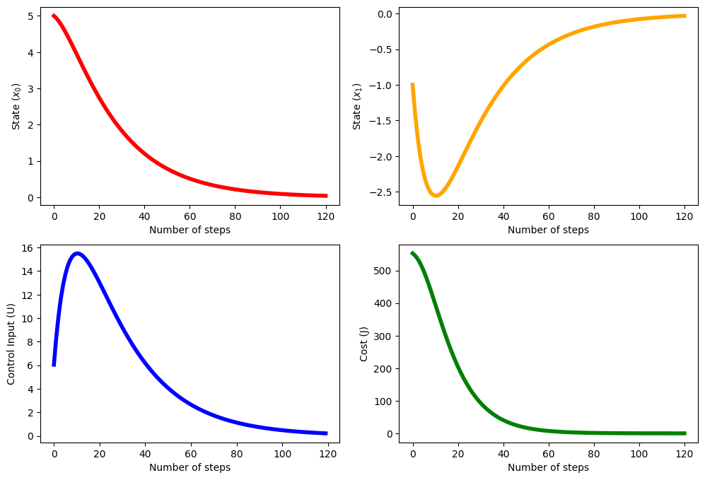
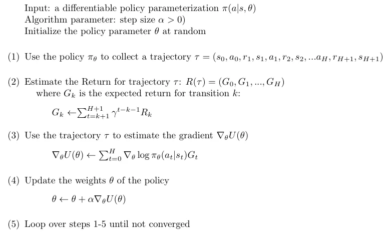
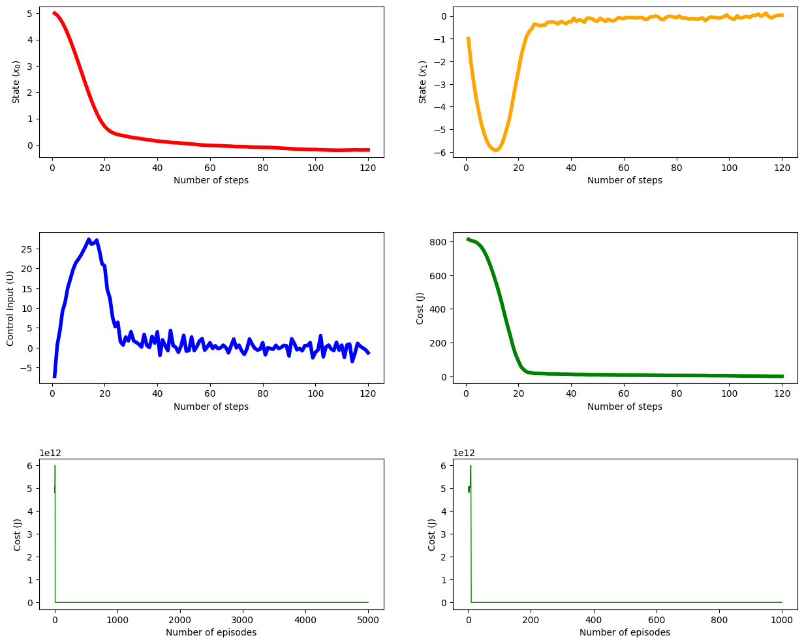
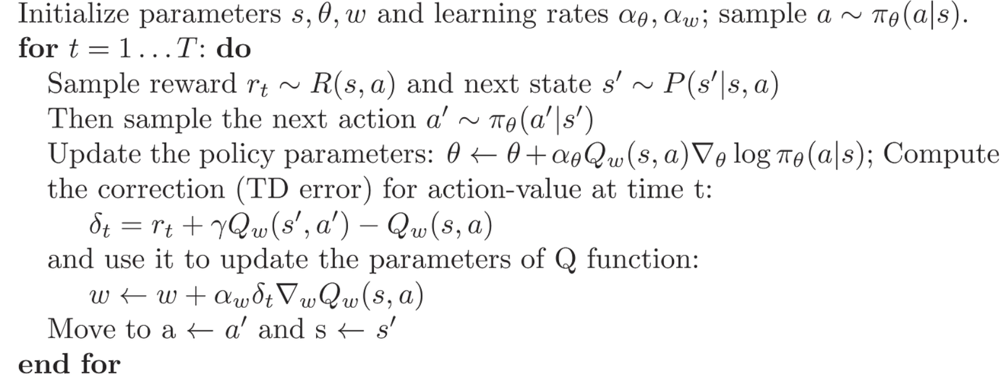
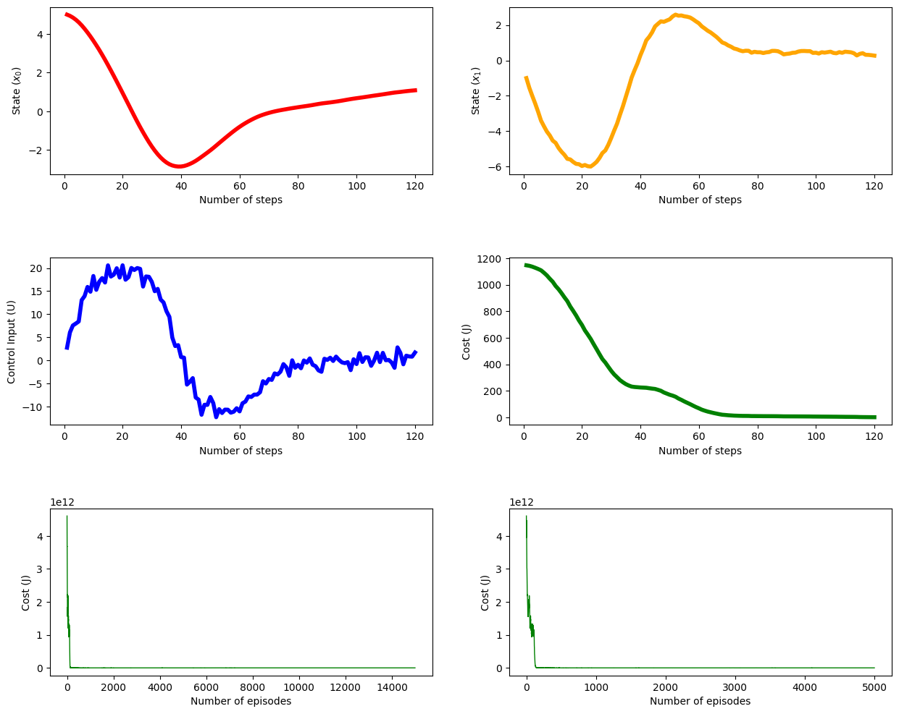

# Cost-Minimisation-through-Reinforcement-Learning

This project was done as a part of the Topics in Reinforcement Learning course offered at IIIT-Hyderabad. The contributors to this project are Likhith Asapu, Aakash Terela, Sukhjinder Kumar, and Parshava Badra. 

# Problem Statement



This problem requires finding an optimal solution to minimize the cost after 120 steps starting at the initial state of $[5,-1]^T$. The cost function and other constants are specified above. 

# Algorithms 

Four Algorithms were implemented to solve this problem. Two model-based algorithms - Dynamic Programming and Value Iteration, Two model-free algorithms - REINFORCE and Actor-Critic algorithm.

# Folder Structure and Instructions to run code

The folder structure is as follows:

```
.
├── README.md
├── ActorCritic.py
├── DynamicProgramming.py
├── ValueIteration.py
├── Reinforce.py
├── Report.py
├── results
|   # result images
│   ├── actor_critic.png
│   ├── dynamic_programming.png
│   ├── policy_iteration.png
│   └── reinforce.png
|   # Algorithm images
│   ├── actor_critic_algo.png
│   ├── dynamic_programming_algo.png
│   ├── policy_iteration_algo.png
│   └── reinforce_algo.png
└──  requirements.txt
```

To run the code, first, install the requirements using the following command:

```
pip install -r requirements.txt
```

To run the code for Dynamic Programming, run the following command:

```
python3 DynamicProgramming.py
```

To run the code for Value Iteration, run the following command:

```
python3 ValueIteration.py
```

To run the code for REINFORCE, run the following command:

```
python3 Reinforce.py
```

To run the code for Actor-Critic, run the following command:

```
python3 ActorCritic.py
```

# Algorithm and Results

The report contains further explanations of the algorithms and the results obtained.

## Dynamic Programming

### Algorithm

### Results


## Value Iteration

### Algorithm

### Results


## REINFORCE
### Algorithm

### Results


## Actor-Critic
### Algorithm

### Results



